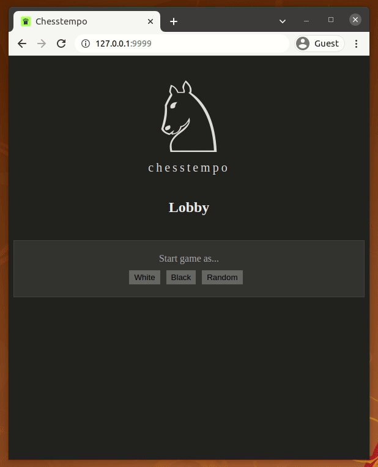

# chesstempo

A chess server built with [Temporal].

## Dependencies

The activity worker runs [Stockfish] in the background.

In Debian-based distros, you can install it with:

    apt-get install stockfish

## Build

Build the front-end first:

    cd http/assets/chesstempo
    npm install
    npm run build

Next, from the root, build the Go binary:

    go build .

Run it as follows:

    ./chesstempo

After `chesstempo` starts, run the activity worker from the root in a
separate terminal as follows:

    go run ./cmd/worker

Go to http://127.0.0.1:9999.

## Demo

[Stockfish]: https://stockfishchess.org/
[Temporal]: https://tempora.io/
